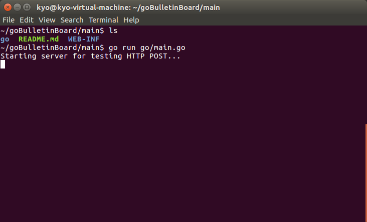
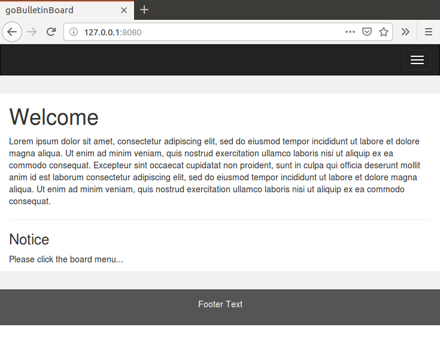
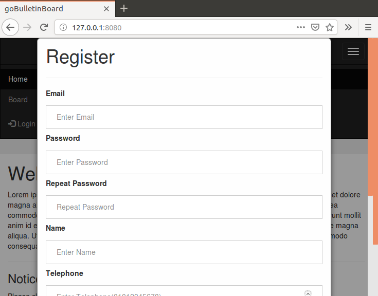
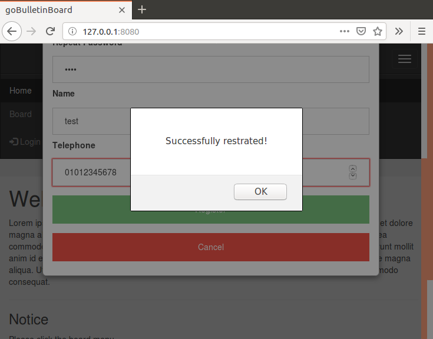
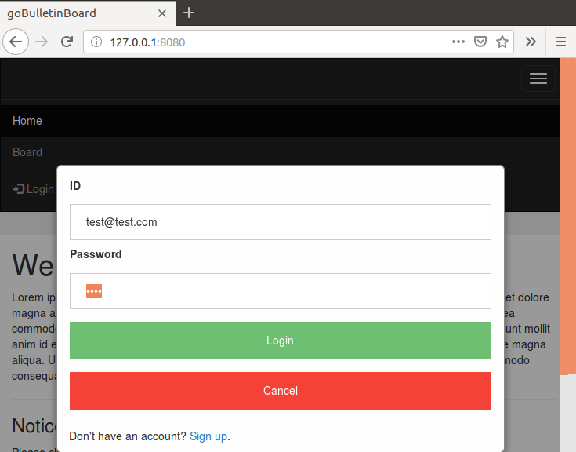
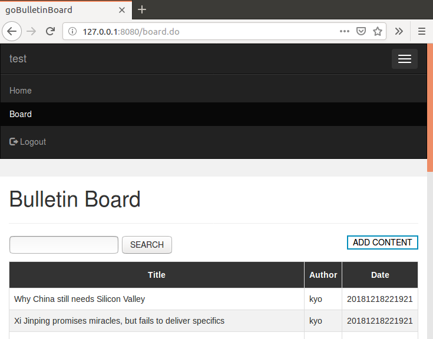
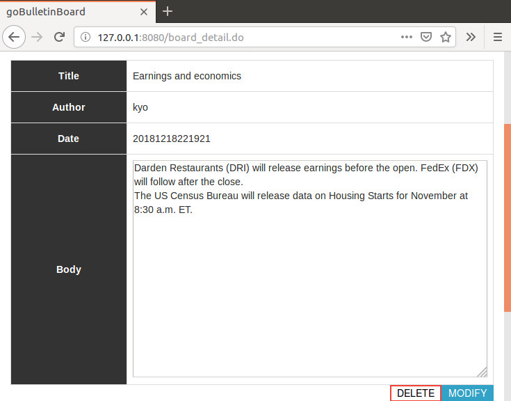

# boardUsingGo
It is server program using GO language.

This directory is the main proeject of this repository.

Before executing this directory, you should install the package using following command.

    $ go get github.com/ziutek/mymysql/thrsafe
    $ go get github.com/ziutek/mymysql/autorc
    $ go get github.com/ziutek/mymysql/godrv

    $ go get -v github.com/ziutek/mymysql/...
    $ go get github.com/gorilla/securecookie

And before executing this directory, you should create tags table which follow description.

    mysql> create table login(email varchar(50) PRIMARY KEY, passwd varchar(512), name varchar(30), telephone varchar(12));
    mysql> create table board( seq INT(10) AUTO_INCREMENT PRIMARY KEY, title VARCHAR(250), author VARCHAR(30), body LONGTEXT, mod_dt CHAR(8), mod_tm CHAR(6), reg_dt CHAR(8), reg_tm CHAR(6) );

And run it using command `go run go/main.go`.

### tutorial
 - start the go commant

 - go to the webpage(127.0.0.1:8080)

 - click the login button

 - click the "Sign up" (it located bottom of the login form) 

 - fill out the registration form and click the "Restrater" button

 - fill out the login form and click the "Login" button

 - click the "Board" tab.

 - you can add the board and show the detail infomation of board and modify and delete it.

